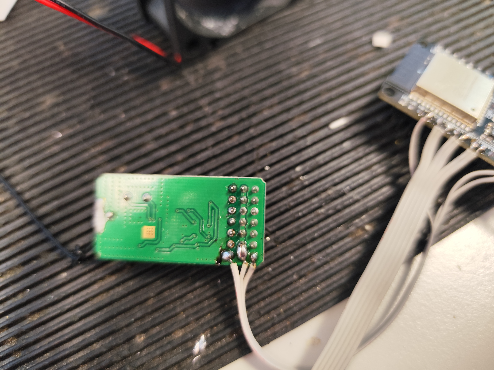
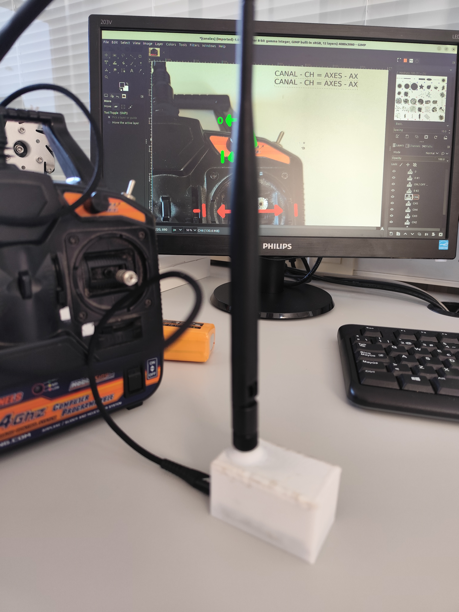
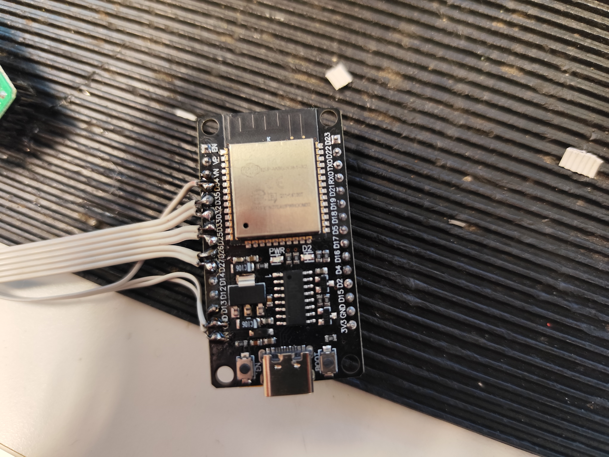

# ros2_caddy_ai2_joystick_esp32_radio_bridge


## Características

Es un sencillo ejemplo de como conectar una radio RC a ROS usando micro-ROS junto a un ESP32 como microcontrolador (MCU).

Genera un topic llamado "/joystick" para ROS 2 Humble con un mensaje de tipo "sensor_msgs/Joy" con 6 axis, uno para cada canal del mando y un conjunto de botones indicando si esta o no la radio conectada. Tiene una frecuencia de funcionamiento de 50 Hz, dada por el mando. Tiene capacidad de auto reconexión con el agente de micro-ROS.

El proceso de calibración se ha realizado utilizando un live script de Matlab (R2023b) en el cuál se distinguen dos tipos de canales, unos completamente lineales con un máximo y un mínimo y otros con un centro con zona muerta con la misma ganancia para la parte superior e inferior del canal. Veáse el calibración.pdf para más información.

## Axes


## Instalación de docker en Linux

Seguir los pasos del siguiente enlace: https://docs.docker.com/engine/install/ubuntu/#install-using-the-repository

Asignar permisos al usuario actual
```bash
sudo usermod -aG docker $USER
```

### Para ejecutar interactivamente el docker con el agente de micro-ros y poder ver el topic en ROS 2

```bash
# Serial micro-ROS Agent
docker run -it --rm -v /dev:/dev -v /dev/shm:/dev/shm --privileged --net=host microros/micro-ros-agent:$ROS_DISTRO serial --dev /dev/ttyUSB0
```

Nota: Ajuste /dev/ttyUSB0 según el puerto serie de su dispositivo. Para ver los dispositivos dispositivos recientemente conectados puedes usar:

```bash
sudo dmesg | grep tty
```

Si no puede cargar el código de Platformio.

```bash
sudo usermod -a -G dialout $USER
```

Visualizar la salida
```bash
ros2 topic echo /joystick
```
### Pendiente:

- [ ] Crear un launch para lanzar el comando directamente.

### Imágenes adicionales






### Enlaces
- https://micro.ros.org/docs/tutorials/advanced/handling_type_memory/
- https://docs.ros2.org/latest/api/sensor_msgs/msg/Joy.html
- https://docs.ros2.org/latest/api/std_msgs/msg/Header.html
- https://github.com/micro-ROS/micro_ros_platformio
- https://github.com/micro-ROS/micro-ROS-demos/tree/jazzy
- https://github.com/micro-ROS/micro_ros_arduino
- https://github.com/micro-ROS/micro_ros_arduino/blob/jazzy/examples/micro-ros_tf_publisher/micro-ros_tf_publisher.ino
- https://github.com/micro-ROS/micro_ros_arduino/blob/jazzy/examples/micro-ros_reconnection_example/micro-ros_reconnection_example.ino
- https://github.com/micro-ROS/micro-ROS-demos/blob/jazzy/rclc/string_publisher/main.c
- https://github.com/micro-ROS/system_modes